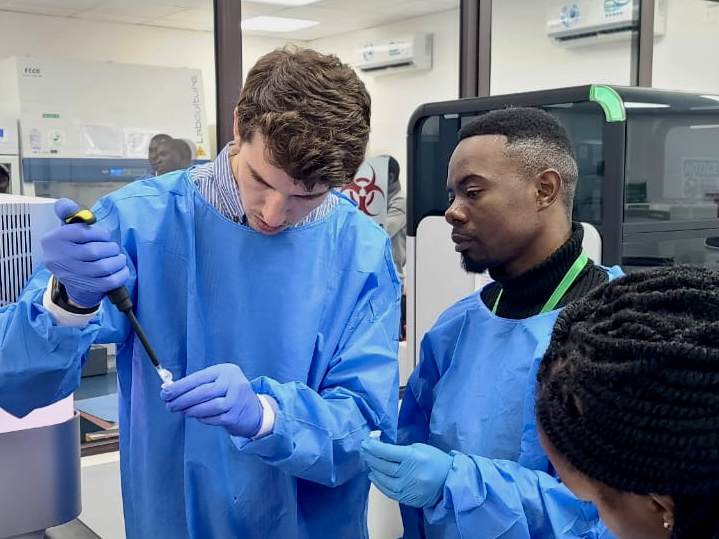

Welcome to my page! I'm William Donovan, a Biostatistics Master's student at Columbia University! But that's not all! I'm originally from Seattle, currently work with infectious diseases, and spend a lot of time outside. Feel free to have a look around! My resume can be found [here](resume.html). And if you like burgers, you can view some sanitation data about Manhattan burger restaurants [here](problem2.html)!

